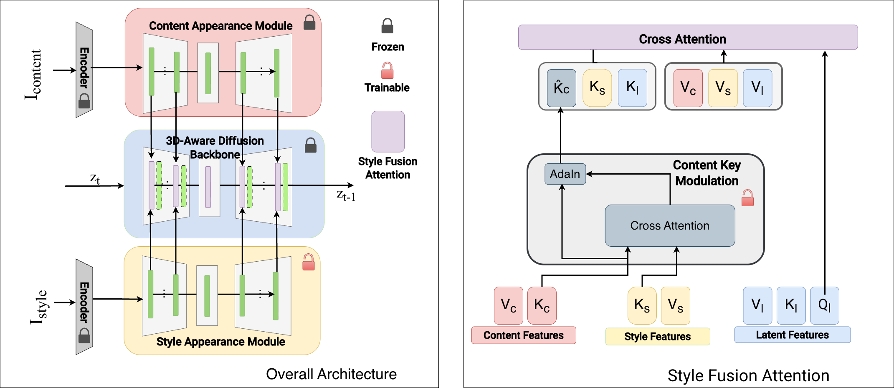

<p align="center">
  <h2 align="center">[ECCV 2026] StyleFusion360: View-Consistent Head Stylization via Adaptive Style Modulation</h2>
  <p align="center">
      <a href="https://furkanguzelant.github.io">Furkan Güzelant</a>
      ·
      <a href="https://agoktogan.github.io/">Arda Göktoğan</a>
      ·
      Tarık Kaya
      ·
      <a href="https://www.cs.bilkent.edu.tr/~adundar/">Ayşegül Dündar</a>
    <br>
    Bilkent University
    <br><br>
    <a href="https://arxiv.org/abs/2511.22411">
      
    </a
    <a href="https://furkanguzelant.github.io/stylefusion360">
      
    </a>
  </p>
</p>


This repository provides the official implementation of **StyleFusion360**, a diffusion-based framework for generating identity-preserving and view-consistent 360-degree head stylizations from a single content image and a single style reference image.

StyleFusion360 preserves fine identity attributes such as accessories, facial expressions, and head geometry while transferring diverse artistic styles across full 360-degree viewpoints without requiring per-style retraining.

## Abstract

3D head stylization has emerged as a key technique for reimagining realistic human heads in various artistic forms, enabling expressive character design and creative visual experiences in digital media. Despite the progress in 3D-aware generation, existing 3D head stylization methods often rely on computationally expensive optimization or domain-specific fine-tuning to adapt to new styles.

To address these limitations, we propose **StyleFusion360**, a diffusion-based framework capable of producing multi-view consistent, identity-preserving 3D head stylizations across diverse artistic domains given a single style reference image, without requiring per-style training. Building upon the 3D-aware DiffPortrait360 architecture, our approach introduces two key components: the **Adaptive Style Modulation** module, which disentangles style from content, and a **style fusion mechanism**, which adaptively balances structure preservation and stylization fidelity in the latent space.

Furthermore, we employ a 3D GAN-generated multi-view dataset for robust fine-tuning and introduce a temperature-based key scaling strategy to control stylization intensity during inference. Extensive experiments on FFHQ and RenderMe360 demonstrate that StyleFusion360 achieves superior style quality, outperforming state-of-the-art GAN- and diffusion-based stylization methods across challenging style domains.

## Method Overview

StyleFusion360 builds on a 3D-aware portrait diffusion backbone and injects style through a style-conditioned feature fusion mechanism. The framework preserves identity and head structure while enabling strong artistic transformations.

### 3D-Aware Diffusion Backbone

The model uses a multi-view portrait diffusion model as its structural prior. Given a content portrait and target camera pose, the backbone provides view-consistent geometry and identity cues across the full 360-degree range.

### Style Fusion Attention

Separate content and style appearance modules encode identity-related structure and artistic appearance. Style Fusion Attention modulates content keys with style features before shared attention, enabling spatially selective stylization without letting the frozen content pathway dominate.

### Multi-View Training

The style modules are fine-tuned with GAN-generated paired multi-view data. This one-time training stage teaches the model consistent stylization across viewpoints while preserving the realism and identity priors of the frozen content branch.

### Local and Controllable Editing

Region masks allow style to be applied to selected areas such as hair, eyes, or mouth, and multiple style references can be fused in one pass. A temperature-based key scaling factor controls stylization strength at inference time.

<p align="center">
  
</p>

## Results

StyleFusion360 is evaluated against leading 3D head stylization and reconstruction methods, including StyleCLIP, StyleGAN-NADA, StyleGAN-Fusion, DiffusionGAN3D, Identity3DHead, and 2D diffusion editing baselines such as InstructPix2Pix and InstantID combined with DiffPortrait360. The method achieves strong style fidelity, identity preservation, and multi-view consistency across diverse artistic domains including cartoon-like and realistic styles.

For qualitative results, comparisons, and additional examples, please visit the project page:

**Project page:** https://furkanguzelant.github.io/stylefusion360

## Requirements

* NVIDIA GPU with CUDA support.
  * Tested on a single A100 GPU.
  * Tested with CUDA 12.1.
  * Minimum recommended GPU memory: 30 GB for generating a single 32-frame novel-view synthesis video.
  * Recommended GPU memory: 80 GB.
* Linux operating system.

## Installation

Clone the repository:

```bash
git clone https://github.com/furkanguzelant/StyleFusion360.git
cd StyleFusion360
```

Create and activate the environment:

```bash
conda create -n stylefusion360 python=3.9
conda activate stylefusion360
pip install -r requirements.txt
```

## Download Pretrained Models

Download the pretrained models from this Google Drive folder:

https://drive.google.com/drive/folders/1Rh_sbMFOWaqV1htn7GC4SSgeKg6kwyRV?usp=sharing

After downloading, update the model paths in the inference script to point to your local checkpoint locations:

* `PANO_HEAD_MODEL`
* `Head_Back_MODEL`
* `Diff360_MODEL`

## Inference

We provide example preprocessed portrait images. To run inference with the provided examples:

```bash
cd diffportrait360_release/code
bash inference.sh
```

### Inference on In-the-Wild Images

For custom images, prepare the cropped portrait image and the corresponding `dataset.json` camera metadata under the input image directory. The preprocessing follows the PanoHead/3DDFA-V2 cropping pipeline:

https://github.com/SizheAn/PanoHead/tree/main/3DDFA_V2_cropping

Then run:

```bash
cd diffportrait360_release/code
bash inference.sh
```

## Paper

The paper is available here:

https://furkanguzelant.github.io/stylefusion360/paper.pdf

## BibTeX

If you find StyleFusion360 useful for your research or applications, please cite:

```bibtex
@misc{guzelant2026stylefusion360viewconsistentheadstylization,
      title={StyleFusion360: View-Consistent Head Stylization via Adaptive Style Modulation}, 
      author={Furkan Guzelant and Arda Goktogan and Tarık Kaya and Aysegul Dundar},
      year={2026},
      url={https://arxiv.org/abs/2511.22411}, 
}
```

## License

This code is distributed under the Apache-2.0 license.

## Acknowledgements

We thank the authors of [DiffPortrait360](https://freedomgu.github.io/DiffPortrait360/) and [Identity Preserving 3D Head Stylization with Multiview Score Distillation](https://three-bee.github.io/head_stylization/) for their open-source contributions, which have been valuable references for our work. We also acknowledge the broader community for releasing related resources, including [PanoHead](https://github.com/SizheAn/PanoHead), [SphereHead](https://lhyfst.github.io/spherehead/), and [ControlNet](https://github.com/lllyasviel/ControlNet).

## IP Statement

Please contact furkan.guzelant@bilkent.edu.tr if there has been any misuse of images, and we will promptly remove them.
